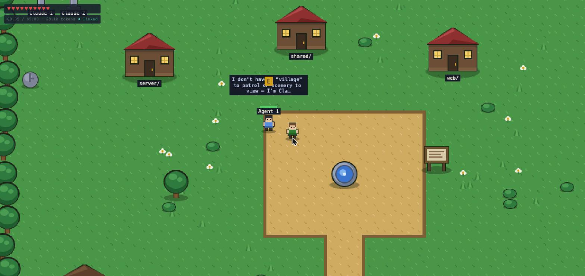

# ⚔️ Agent Quest

**A Zelda-style control room for Claude Code agents.**

Your repo is a village. Your agents are villagers. Walk up and talk to
steer them, tap them to interrupt, and watch their context window drain
like a health bar. Built with Phaser 3, React 19, and the Claude Agent
SDK — see [DESIGN.md](./DESIGN.md) for the full vision (all four
implementation phases are built).


## How it works

Every NPC in the village is a **real Claude Code session**. Summon one at
the portal, hand it a quest, and it walks into town and gets to work:

- 🧠 **Context window = health bar.** Auto-compaction restores it.
- ❤️ **Your hearts = the shared budget.** At zero, everyone falls asleep.
- 🏠 **One house per top-level directory.** Agents visibly walk to the
  district they're editing.
- ⚔️ **Subagents are minions.** Parallel fan-outs get a party badge;
  background tasks burn as campfires.
- 📜 **Quests come from your repo.** The quest board scans stale
  branches, TODO/FIXME bounties, and README gaps.

| The village | Summoning at the portal |
| --- | --- |
|  |  |

## Quick start

```sh
npm install
cp .env.example .env   # optional — all settings have defaults
npm run dev            # control server on :8787, game on :5173
```

Open http://localhost:5173, walk south to the glowing portal, press `E`.

Want to explore without spending a cent? Run the whole game on scripted
fake agents:

```sh
AGENT_QUEST_DEMO=1 npm run dev
```

### Controls

| Key | Action |
| --- | --- |
| `WASD` / arrows | Move |
| `E` | Interact — talk, summon, read, poke ducks |
| `M` | The Mirror: live agent grid, tap to warp |
| `J` | Journal drawer (quest log) |
| `` ` `` | Cheat console: noclip, speed, warp, reveal, god mode |

Configuration lives in a single `.env` at the repo root (see
[.env.example](./.env.example)): demo mode, budget, agent cap, port, and
`ANTHROPIC_API_KEY` (if unset, the SDK falls back to this machine's
Claude Code credentials).

## Features

**Phase 1 — core loop**
- Village + movement, portal summon with model-as-equipment and
  permission gate choice (§1, §8)
- Real agents as NPCs via the Claude Agent SDK: status animations,
  NPC health = context window, player hearts = shared budget (§2, §3)
- Talk/steer, interrupt, resume, dismiss, allow/deny (§7)

**Phase 2 — visibility depth**
- The Mirror (`M`): live agent grid, attention pulse, tap to warp (§4)
- Inventory: tools/skills/MCP items with used-this-session glow; model
  as an equipment slot with real mid-session re-equip (§5, §5a)
- Quest log from TaskCreate/TaskUpdate; journal drawer (`J`) (§6);
  camp clustering past 6 NPCs with Mirror promotion (§12)

**Phase 3 — a living world**
- Repo-as-village districts; agents walk to where they're working (§1, §12)
- Quest board scanned from the repo; accepting prefills the portal (§9a, §9b)
- Subagent minions, party badges, scroll-flash returns, campfires (§13, §14)
- Plan mode = draft quest log; CLAUDE.md as a memory tome; Auto Mode
  gatekeeper NPC (§14)

**Phase 4 — depth & delight**
- Revive saved sessions from the portal (§8a)
- The Tavern: procedural bard, town crier reading recent commits,
  library keyed to live activity, a garden (§9d)
- The Scrying Pool: summons a real Haiku scout to web-search (§9e)
- Easter eggs (§15) and the cheat console — god mode is real Auto Mode (§16)

**Known gaps (honest ones):** hooks-as-wards and the trophy rewind
mechanic have no reliable SDK signal yet; live attach to a session
running in another terminal (Remote Control) has no public API. All
three are noted in DESIGN.md and wait on upstream support.

## Layout

```
shared/protocol.ts   wire types: AgentSnapshot, ClientCommand, ServerEvent
server/              Node/TS control layer — owns the live session handles (§11)
  src/agentSession.ts  one SDK query() per NPC: streaming input, interrupt,
                       permission callback, telemetry derivation
  src/sessionManager.ts registry + budget + broadcast
web/                 Vite + React 19 + Phaser 3 game client
  src/game/            the village scene (all textures generated at runtime —
                       no asset files, just Phaser graphics calls)
  src/components/      HUD hearts, summon/talk dialogs, toasts
```

## Quality gate

```sh
npm run build && npm run test && npm run check
```

Note: the in-game dialogs are intentionally custom pixel-styled UI rather
than shadcn components; semantic color tokens live in `web/src/index.css`.
