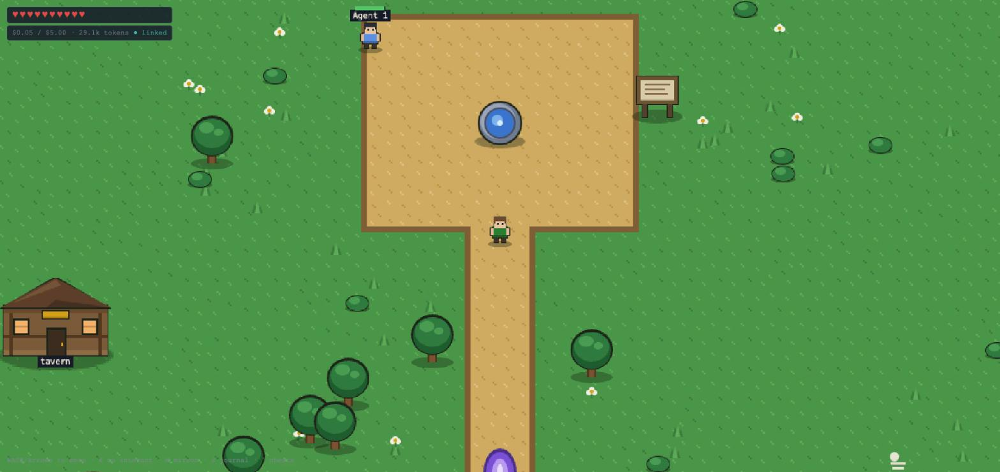
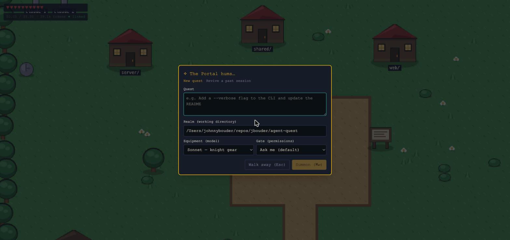
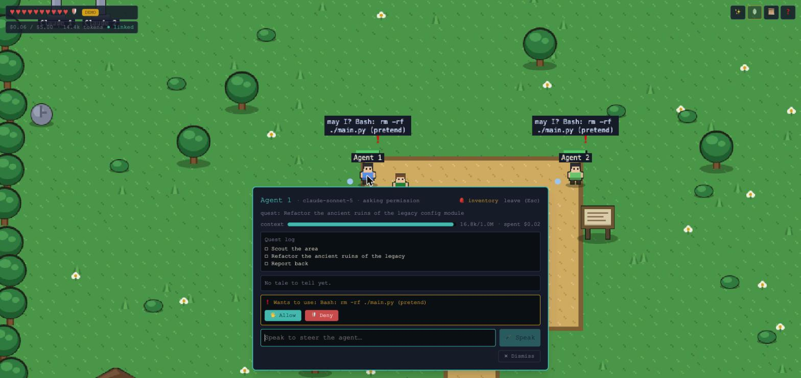
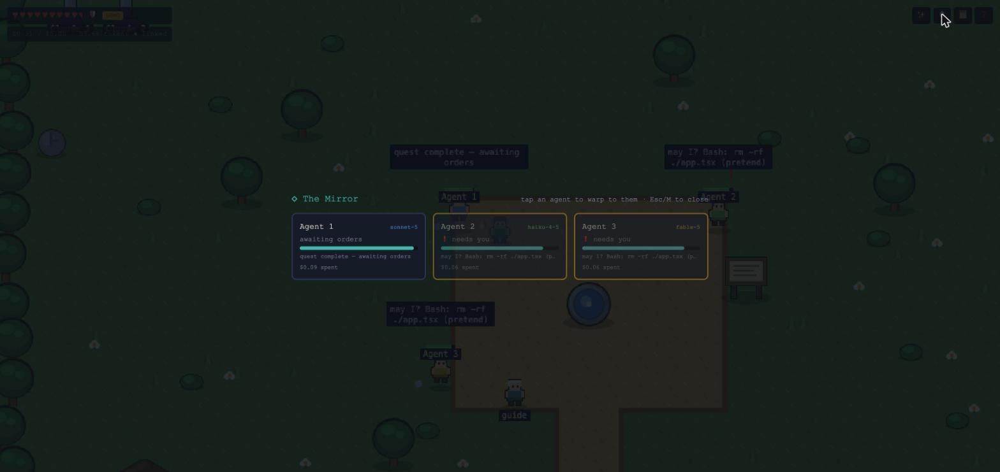
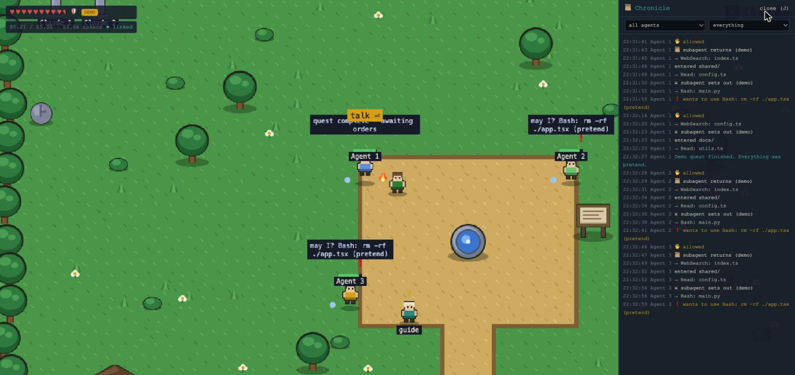

# ⚔️ Agent Quest

**A Zelda-style control room for Claude Code agents.**

Your repo is a village. Your agents are villagers. Walk up and talk to
steer them, tap them to interrupt, and watch their context window drain
like a health bar. Built with Phaser 3, React 19, and the Claude Agent
SDK — see [DESIGN.md](./docs/DESIGN.md) for the full design.



## How it works

Every NPC in the village is a **real Claude Code session**. Open the
✨ Scroll of Summoning from anywhere, hand it a quest, and an agent
walks into town and gets to work:

- 🧠 **Context window = health bar.** Auto-compaction restores it.
- ❤️ **Your hearts = the shared budget.** At zero, everyone falls asleep.
- ⚔️ **Subagents are minions.** Parallel fan-outs get a party badge;
  background tasks burn as campfires.
- 📜 **Quests come from your repo.** The quest board scans stale
  branches, TODO/FIXME bounties, and README gaps.
- 🖱 **Click/tap anything** — an agent, the quest board, the tavern —
  or walk up and press Space/Enter.

| Summoning | Talking to an agent |
| --- | --- |
|  |  |
| **The Mirror** | **The Chronicle** |
|  |  |

## Quick start

```sh
npm install
cp .env.example .env   # optional — all settings have defaults
npm run dev            # control server on :8787, game on :5173
```

Open http://localhost:5173 and follow the guide's tour — or hit ✨ in
the top-right and summon your first agent.

Want to explore without spending a cent? Run the whole game on scripted
fake agents:

```sh
AGENT_QUEST_DEMO=1 npm run dev
```

### Controls

Click or tap anything to interact with it — no keys required. The
persistent icon row (top right) opens the global overlays: ✨ Summon,
🪞 Mirror, 📜 Chronicle, ❓ Help. Optional keyboard accelerators:

| Key | Action |
| --- | --- |
| `WASD` / arrows | Move |
| `Space` / `Enter` | Interact with whatever's in range (`E` also works) |
| `M` | The Mirror: live agent grid, tap to warp |
| `J` | The Chronicle: every agent's journal, one filterable feed |
| `` ` `` | Cheat console: noclip, speed, warp, reveal, god mode |

Every dialog answers the same keys: `Tab` / `Shift+Tab` move between its
controls and stay inside it, `Enter` or `Space` presses the focused one,
and `Esc` closes it. Focus returns to whatever opened the dialog, so
`Esc` with nothing open steps off the icon row and gives the keyboard
back to the world.

Configuration lives in a single `.env` at the repo root (see
[.env.example](./.env.example)): demo mode, budget, agent cap, port, and
`ANTHROPIC_API_KEY` (if unset, the SDK falls back to this machine's
Claude Code credentials).

## Features

### Agents as villagers

- **Summon from anywhere.** The ✨ Scroll of Summoning takes a quest
  description, a model (equipped like gear), and a permission gate
  choice, and a new NPC walks into town.
- **Full control while they work.** Walk up (or tap) to talk and steer
  mid-task, interrupt, resume, or dismiss. Permission requests surface
  as allow/deny prompts in the world.
- **Status you can read at a glance.** NPC animations track what the
  session is actually doing — thinking, running tools, waiting on you,
  or done.
- **Revive and fork.** Saved sessions can be revived from the summon
  dialog. A ● live session offers "Attach (fork)": it forks into a twin
  you fully control while the original keeps running elsewhere. The
  twin is marked ⧉ everywhere so it's never mistaken for the original.

### Two resources, two bars

- **Context window = each NPC's health.** It drains as the session's
  context fills; auto-compaction restores it.
- **Your hearts = the shared token budget.** Every agent draws from the
  same pool. At zero hearts, everyone falls asleep until you raise the
  budget.

### Subagents & parallel work

- **Subagents are minions** that spawn beside their parent. Parallel
  fan-outs get a party badge; background tasks burn as campfires until
  they finish.
- **Scroll-flash returns** when a subagent reports back, and scratch
  marks stay behind where minions finished their work.
- **Camp clustering** keeps the square readable past six NPCs —
  overflow agents pitch camp, with promotion back to the square via the
  Mirror.

### Visibility & oversight

- **The Mirror (`M`)** — a live grid of every agent with an attention
  pulse on whoever needs you; tap any tile to warp to that agent.
- **The Chronicle (`J`)** — every agent's journal merged into one
  filterable feed.
- **Quest log** — each agent's task list, live from the SDK's task
  tracking; plan mode shows up as a draft quest log you approve before
  work starts.
- **Inventory** — the tools, skills, and MCP servers an agent carries,
  with a used-this-session glow. The model is an equipment slot with
  real mid-session re-equip.

### A living world built from your repo

- **The quest board** is scanned from the repo itself — stale branches,
  TODO/FIXME bounties, README gaps. Accepting a quest prefills the
  summon scroll.
- **Side quests with mechanics of their own:** overgrown ruins, a
  traveling merchant, a trickster, escorts, raid bosses with a boss
  bar, and a fishing dock that only opens while a long job runs.
- **Rewind:** the agent that runs `git commit` owns the commit; a later
  revert rewinds that agent's trophy in place instead of erasing it.
- **Monuments and trophies** commemorate sessions that landed real
  work — walk up and read them.
- **Hooks are wards.** Every configured hook (read from the settings
  cascade) renders as a rune circle, with a boundary ward-line wherever
  a hook can actually block an action.
- **CLAUDE.md is a memory tome**, and Auto Mode is guarded by a
  gatekeeper NPC.

### A world to explore

- **Nine areas in a 3×3 world** around the central square: Ruins,
  Watchtower, Frontier, Tavern, Arena, Docks, South Road, and the
  Shopping District.
- **Discovery by walking.** Areas stay ??? on the Map until you first
  enter them, persisted across sessions.
- **The 🗺 Map** shows discovered areas, your position, and live pins —
  board quests, camp overflow, merchant stock, raids, the open dock —
  with fast travel to any discovered area.

### Shops & marketplace

The Shopping District's three stalls are real marketplace browsers:

- **The Skill Apothecary** — anthropics/skills
- **The Plugin Smithy** — the official claude-code marketplace
- **The Connector Emporium** — the MCP registry

Buying is installing: skills land in `.claude/skills/`, plugins in
`enabledPlugins` in `.claude/settings.json`, connectors in `.mcp.json`.
Selling back reverses each — no tokens spent either way. Shelves
restock from the live registries, and a "just in" shelf plus a 🛍 Map
pin surface stock you haven't seen before.

### Downtime

- **The Tavern** — a procedural bard, a town crier reading recent
  commits, a library keyed to live activity, and a garden.
- **The Scrying Pool** — summons a real Haiku scout to web-search while
  you wait on longer work.

### Customization & the World Codex

- **Reshape the world from inside it** with the World Codex (✎):
  ground palette, your tunic and pace, heart count, ward styling,
  renames, and your own recurring board notices.
- **Preview before apply**, and every apply is one-click revertible — a
  real history stack, not an undo gesture.
- **Rift boundaries:** a broken change tears an in-world rift over that
  surface only, while agents keep running underneath. Sealing the rift
  reverts the last change. Try it: `` ` `` then `rift world`.

### Onboarding & extras

- **A guide NPC by the fountain** runs a replayable tour, backed by
  first-time contextual hints and a searchable in-game reference (❓).
- **A cheat console** (`` ` ``): noclip, speed, warp, reveal — and god
  mode, which is real Auto Mode.
- **Easter eggs.** They're hidden. That's the point.

## Layout

```
shared/protocol.ts   wire types: AgentSnapshot, ClientCommand, ServerEvent
server/              Node/TS control layer — owns the live session handles
  src/agentSession.ts  one SDK query() per NPC: streaming input, interrupt,
                       permission callback, telemetry derivation
  src/sessionManager.ts registry + budget + broadcast
web/                 Vite + React 19 + Phaser 3 game client
  src/game/            the village scene (all textures generated at runtime —
                       no asset files, just Phaser graphics calls)
  src/components/      HUD hearts, summon/talk dialogs, toasts
```

## Quality gate

```sh
npm run build && npm run check
```

Note: the in-game dialogs are intentionally custom pixel-styled UI rather
than shadcn components; semantic color tokens live in `web/src/index.css`.
